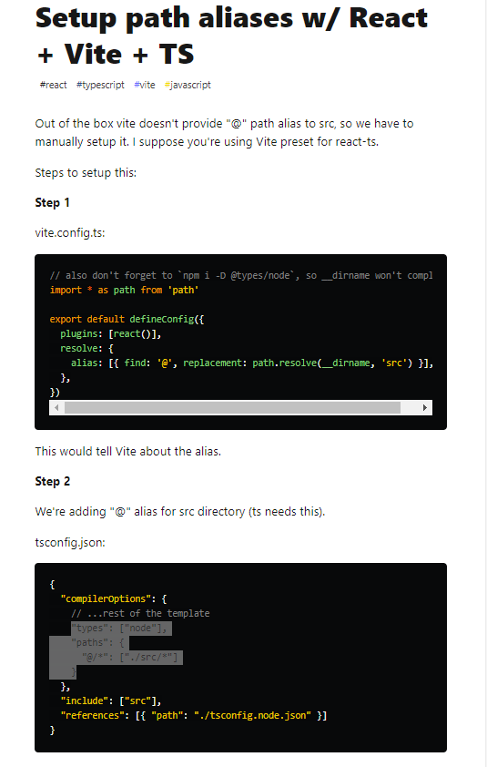
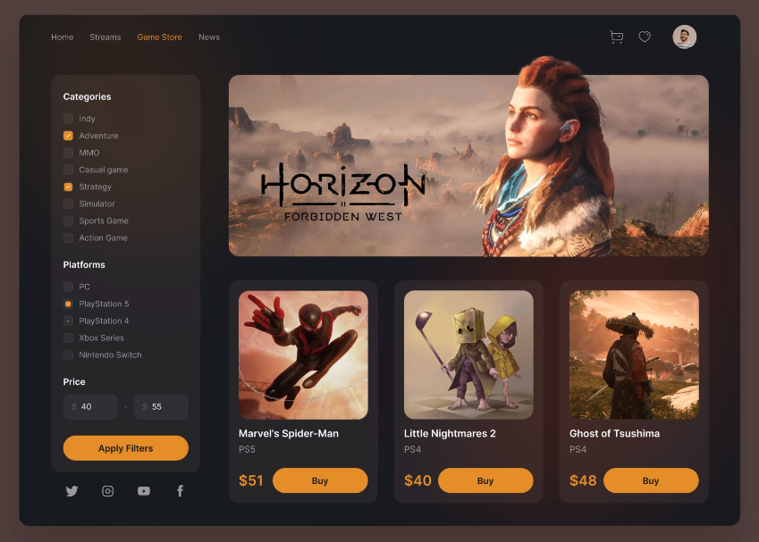

# design-video-store
## _Course based on Youtube video with jotredev_
[Diseño UI tienda de videojuegos con React JS y Tailwind CSS totalmente responsivo](https://www.youtube.com/watch?v=Q69vJCCCsp8)

## 0a. Preconditions
1. Install the NPM and NODEJS in your system [Nodejs Download](https://nodejs.org/en/download/current/)
2. Check in $path or %path% the nodeJS and npm are on it
  ```Mathematica
  C:/Program Files/nodejs
  ```
3. Install also `pnpm` [pnpm installation](https://pnpm.io/installation), it is more fast than `npm`
4. Install Visual Studio Code
  [Visual Studio Download](https://code.visualstudio.com/insiders/)

## 0b. Starting the proyect
1. I used [Vite](https://vitejs.dev/guide/), the best way to start any front-end project, with Typescrypt and a lot of templates:
```Mathematica
npm init vite@latest design-video-store --template react-ts
```
2. Following the instructions, install the applications based on the `package.json` file.
```Mathematica
pnpm install
```
3. To activate tha Alias, check this page [Setup path aliases w/ React + Vite + TS](https://dev.to/avxkim/setup-path-aliases-w-react-vite-ts-poa), the run this command:
```Mathematica
pnpm i -D @types/node
```


## 0c. Install Tailwind CSS and check
1. Go the [Tailwind CSS](https://tailwindcss.com/docs/installation), and select "Framework Guides" option.
2. Becasue I used the "Vite", select "Vite". 
3. Run this command of the 2 step "Install Tailwind CSS" option, in a terminal:
```Mathematica
pnpm install -D tailwindcss postcss autoprefixer
```
4. Run this process to Initialize the tailwind css or create the config Tailwind file:
```Mathematica
npx tailwindcss init -p
```
5. Add the paths into the `content: [],` to all of your template files in your "tailwind.config.js" file.
```javascript
  content: [
    "./index.html",
    "./src/**/*.{js,ts,jsx,tsx}",
  ],
``` 
6. Delete all code into "scr/index.css" file, to let only the `@tailwind` directives:
```javascript
@tailwind base;
@tailwind components;
@tailwind utilities;
```
7. Delete App.css" file.
8. Inside the "App.tsx" delete all into the first `<>` element, below the `return`, and also delete all unused code, this is only code to let it:
```javascript
function App() {
  return (
    <>
    </>
  )
}
export default App
```
9. Become the `<>` element to `<div>` with a `className`:
```javascript
      <div className="bg-red-400">
```
10. And run the application.
```Mathematica
pnpm dev
```
## 0d. Install React icons
1. From the [React Icons](https://react-icons.github.io/react-icons/) site, install the react icons:
```Mathematica
pnpm install react-icons --save
```
### Note: this is the goal to do in this process:


## 1. Adding the "Header" or Top Navegation.
1. Put a basic color in the "index.html" 
file using the `<body>`and adding a class:
```html
<body class="bg-[#181A20]">
```
2. Change the Title in "index,html" file:
```html
<title>Video Games Store Online</title>
```
3. Create a directory called "pages".
4. Create a file "Home.tsx" and run `rfce` snippet. Remember to delete the first line, _not require the import of react_.
3. Create a directory called "components", inside the "pages" directory. 
4. Create a file "Header.tsx" and run `rfce` snippet. Remember to delete the first line, _not require the import of react_.
5. Create a "index.ts" file into "components", an put this info:
```javascript
export { default as Header } from './Header';
```
6. Add the `import` of `Header`into "Home.tsx" file:
```javascript
import {Header} from './components';
```
7. Add a "index.ts" file into "pages" directory, whit this info:
```javascript
export { default as Home } from './Home';
export * from './components';
```
8. Finally add the `import` of `Home` into "App.tsx" file:
```javascript
```
9. Call into the `<div>` element below `return`, the `<Home/>` element, this is the current "App.tsx" file:
```javascript
import { Home } from "@/pages"
function App() {
  return ( <div><Home/></div> )
}
export default App
```
10. Instead of "Home" in "Home.tsx" file add the `<Header/>` element.
11. To the `<div>` element in "Home.tsx" add a `className` with some attributes:
```javascript
    <div className="min-h-screen">
      <Header />
    </div>
```
12. Change the `<div>` element of "Header.tsx" file by `<Header>` and add a `className`:
```javascript
return <header className="text-gray-300">
```
13. Instead of `Header` text change for `<ul>` and `<li>` elements.
14. The element into `<li>` could be `<a href ="#">` or `<Link>`, We use `react-router-dom`, then install it:
```Mathematica
pnpm install react-router-dom
```
15. Add an `import` into "App.tsx" file:
```javascript
import { BrowserRouter, Routes, Route } from 'react-router-dom';
```
16. In "App.tsx" file Add the `BrowserRouter`, and `Routes` components are arround the `<Header />`, and use the `Route path=` point to `Home`:
```javascript
    <BrowserRouter>
      <Routes>
        <Route path="/" element={<Home />} />
      </Routes>
    </BrowserRouter>
```
17. for each `<li>` use a `Link` to point to _root_.
```javascript
    <header className="text-gray-400">
      <ul>
        <li> <Link to="/">Home</Link> </li>
        <li> <Link to="/">Streams</Link> </li>
        <li> <Link to="/">Games Store</Link> </li>
        <li> <Link to="/">News</Link> </li>
      </ul>
    </header>
```
18. `import`the [Remix Icon](https://react-icons.github.io/react-icons/icons?name=ri) into "Header.tsx" file, to use in the second `<ul>` element:
```javascript
import { RiShoppingCartLine, RiHeart2Line } from "react-icons/ri";
```

20. Copy this picture into "/src/assets" directory:


21. Add Other `<ul>` element to show the Icons at right:
```javascript
      <ul>
        <li> <button><RiShoppingCartLine/></button> </li>
        <li> <button><RiHeart2Line/></button> </li>
        <li> <button></button> </li>
      </ul>
```
22. Add to `<header` a padding _y_ of 4, padding _x_ of 10, item center, flex , y justify between:
```javascript
<header className="text-gray-400 py-4 px-10 flex items-center justify-between">
```
23. Add a `className` to first `<ul>` element:
```javascript
<ul className="flex items-center gap-6">
```
24. Add a `Hover`to each `<li>` element, using two variables:
```javascript
const orangeColor = 'text-[#E58D27] transition-colors';
  const hoverColor = "hover:"+orangeColor;
```
26. Add a `className` to the second `<ul>`:
```javascript
<ul className="flex items-center gap-6 text-xl">
```
27. Add the same `className` to the each `<button>`.

## 2a. Sidebar or Left hand navigation Menu
1. Add two component into '/pages/components' called "Sidebar.tsx" and "Content.tsx" files.
2. run the `rafce`, delete the first line, and update the "index.ts" file.
3. Add in "Home.tsx" file the components `<Sidebar/>`, and `<Content/>` below the `Header` into a `<div>`:
```javascript
    <div className="min-h-screen">
      <Header />
      <div className="h-[90vh] p-8">
      <Sidebar/>
      <Content/>
      </div>
    </div>
```
4. Need to add the 10% missing in "Header.tsx" file in the `<header` element:
```javascript
 <header className={"h-[10vh] text-gray-400 py-4 px-10 flex items-center justify-between "+darkBrown}>
``` 
5. Add a `className` into the `<div>` of "Sidebar.tsx" file:
```javascript
<div className="w-64 h-full overflow-y-scroll">
```
6. Add a `className` into the `<div>` of "Content.tsx" file, to expand the rest to the right:
```javascript
<div className=" flex-1 h-full overflow-y-scroll">
```
7. Add two `<div>` into "Sidebar.tsx" file.
8. Add in the first `<div>` element, a `<h4>`, and more elements to show checkbox:
```javascript
      <div className={"bg-" + brownColor + " rounded-xl p-4"}>
        <h4>Categories</h4>
        <div className="flex items-center gap-4">
          <input type="checkbox" id="indy" />
          <label htmlFor="indy">Indy</label>
        </div>
      </div>
```
9. Repeat the `<div>` of each check box 7 times more to complete this list: Indy, Adventure, MMO, Casual Game, Strategy, Simulator, Sports Game, Action Game.  
10. Below the `<h4>` add `<div>` arround all `<input` checkbox type.
11. Add to this `<div>` a `className`:
```javascript
<div className="flex flex-col gap-2">
``` 
12. Add another `<h4>` with Paltforms
```javascript
<h4 className="my-6">Platforms</h4>
```
13. Repeat the `<div>` of each check box  times more to complete this list: PC, PlayStation 5, PlasyStation 4, Xbox Series, Nintendo Switch.
14. Copy another `<h4>` for Price:
```javascript
<h4 className="my-6">Price</h4>
```
15. Add a `<form>` to include the `<input>` element with only numbers:
```javascript
        <form action="submint">
          <div>
            <input type="number" className={"bg-"+darkBrown+" py-2 px-4 rounded-xl"}/>
            </div>
        </form>
```
16. Add a Dolar symbol as an icon and put into the   `<input>`:
```javascript
          <div className="relative">
            <RiMoneyDollarCircleLine className="absolute left-2 top-1/2 -translate-y-1/2 text-xl" />
            <input
              type="number"
              className={
                "bg-" + darkBrown + " py-2 pl-8 pr-4 rounded-xl w-full"
              }
            />
          </div>
```
17. Add an `<span>`, and duplicate the `<input type="number"`
18. Add a `className` to the `<form>`:
```javascript
```
## 2b. Side bar the Filter button and Social Media
1. When start the app,  the colors don't appear then remove the `import` from "colors.ts" file , and put manually the colors to each element.
2. Add a `<button>` just over the `</form>` in "Sidebar.tsx" file, with a `type="submit"`:
```javascript
        <button type="submit"> </button>
```
3. Put a `<div>` arround the both `<div className="relative">`, and add a `className`, movirn form the `<form>`:
```javascript
        <form>
          <div className="flex items-center justify-between gap-2">
            <div className="relative">
              ...
            </div>
            <span>-</span>
            <div className="relative">
             ...
            </div>
          </div>
          <button type="submit">Apply Filters</button>
        </form>
```
4. Add to the `<form>` a new `className`:
```javascript
        <form className="flex flex-col gap-6">
```
5. Add a `className` to the `<button>`:
```javascript
<button type="submit" className="bg-[#E58D27] text-black rounded-full w-full p-2">Apply Filters</button>
```
6. Add to the three `<h4>` in `className`:
```javascript
      <h4 className="my-6 text-white text-lg">
```
7. Add a `hover:` to the `<button>`, into the `className`:
```javascript
hover:-translate-y-1 transition-all duration-200
```
8. Adding the Social Media:
```javascript
<ul className="flex items-center justify-between">
  <li><a href="https://www.twitter.com" target="_blank" className="text-2xl"><RiTwitterLine/></a> </li>
  <li><a href="https://www.instagram.com" target="_blank" className="text-2xl"> <RiInstagramLine/></a> </li>
  <li><a href="https://www.youtube.com" target="_blank" className="text-2xl"><RiYoutubeLine/> </a> </li>
  <li><a href="https://www.facebook.com" target="_blank" className="text-2xl"><RiFacebookLine/> </a> </li>
</ul>
```
## 3. Complete the Content or Right side.
1. Add a `className` to check box:
```javascript
className="accent-[#E58D27]"
```
2. Add a Picture `` into "content.tsx" file.
3. Add a "Card.tsx" file.
```javascript
const Card = (props:{ img:string, title:string, category:string, price:string }) => {
  return (
    <div className="bg-[#362C29]/50 p-6 rounded-2xl flex flex-col gap-2">
      {" "}
      
      <h1 className="text-xl text-white">{props.title}</h1>
      <span className="text-gray-400">{props.category}</span>
      <div className="flex items-center gap-4">
        <h5 className="text-3xl text-[#E58D27]">${props.price}</h5>
        <button
          className="bg-[#E58D27] text-black font-bold rounded-full w-full p-3 hover:-translate-y-1 transition-all
duration-200"
        >
          Buy
        </button>
      </div>
    </div>
  );
};
```
4. Call this car into "content.tsx" file:
```javascript
        <Card
          img="https://image.api.playstation.com/vulcan/img/rnd/202011/0714/vuF88yWPSnDfmFJVTyNJpVwW.png"
          title="Marvel's Spider-Man"
          category="PS5"
          price="51"
        />
```
5. All the `<Card` ar into a `<div>` with `className`, and the very important there is `flex-wrap`: 
```javascript
    <div className="flex items-center justify-between flex-wrap gap-8">
```

## 4a. Responsive the First Top-Menu or Header
1. Add a `<button>` with this `RiMenu2Line` icon in "Header.tsx" file over the First Menu:
```javascript
<button className="lg:hidden"><RiMenu2Line/></button>
```
2. Add a `hidden` to the First Menu in "Header.tsx" file:
```javascript
<ul className="hidden lg:flex items-center gap-6">
```
3. Add a Menu Mobile, below the first `<button>`:
```javascript
      <div className="fixed left-0 top-0 w-full h-full z-50 bg-[#181A20]">
        <ul>Menu Mobile</ul>
      </div>
```
4. Add `useState` like this:
```javascript
const [showMenu, setShowMenu ] = useState(false);
```
5. The `<button>` Activate or not the menu, and the menu appear based on the `showMemenu` status:
```javascript
      <button onClick={()=> setShowMenu(!showMenu)} className="lg:hidden">
        <RiMenu2Line />
      </button>
      <div className={`fixed left-0 w-full h-full z-50 bg-[#181A20] ${showMenu?"top-0":"-top-full"} transition-all`}>
        <ul>Menu Mobile</ul>
      </div>
```
6. Add a `<button>` over the `<ul>Mobile Menu`:
```javascript
        <button onClick={()=> setShowMenu(!showMenu)}><RiCloseLine/></button>
```
7. Center the items of Menu only in new `<ul>` adding a `className`:
```javascript
<ul className=" w-full mt-20">
```
8. For the Menu add some elements to `className`, as `block text-center p-4 text-4xl`.

## 4b. Responsive the Sidebar
1. Put some elements in the `className` of first `<div>` in "Sidebar.tsx" file, to hide when is mobile, and only shows in PC:
```javascript
<div className="w-[80%] fixed lg:static top-0 -left-full lg:w-80 h-full overflow-y-scroll text-gray-400 bg-[#181A20] transition-all duration-200 p-3">
```
2. Add a `<>` element and move all inside this element
3. Add a `<button>` with `RiFilterLine` icon:
```javascript
      <button className="text-lg fixed bottom-4 right-4 bg-[#E58D27] rounded-full z-40 lg:hidden"><RiFilterLine/></button>
```
4. Add an `useState` to show the Filter:
```javascript
const [showSidebar, setShowSidebar] = useState(false);
```
5. Use the condition in the first `<div>`:
```javascript
<div className={`w-[80%] fixed lg:static top-0 ${showSidebar?"left-0":"-left-full"} lg:w-80 h-full overflow-y-scroll text-gray-400 bg-[#181A20] transition-all duration-200 p-3`}>
```
6. the last `<button>` add a condition to show the `RiCloseLine` or `RiFilterLine` :
```javascript
{showSidebar? <RiCloseLine/>:<RiFilterLine/>}
```
7. for the 'IPad Air' device add `className` of first `<div>`the use of `md`:
```javascript
      `... md:w-[40%] ...`
```

## 4c. Responsive the elemens in Content
1. Change `className` elements of first image in "Content.tsx" file:
```javascript
        className="w-full h-[500px] object-cover object-right md:object-top rounded-2xl"
```
### Note: Better `object-cover` than `object-container`.

2. Change in "Cart.tsx" file the first `<div>`:
```javascript
    <div className="bg-[#362C29]/50 p-6 rounded-2xl flex flex-col gap-2 w-full md:w-auto">
```
3. Change in `className`of `<div>` container of all cards the `justify-between` by `justify-arround` in "Content.tsx" file:
```javascript
      <div className="flex md:grid md:grid-cols-2 lg:flex items-center justify-around  lg:justify-between flex-wrap gap-8">
```
4. Change in "Cards.tsx" file in `` some elements in the `className`:
```javascript
      
```
5. Adding to `className` of "Sidebar.tsx" file this `lg:p-0`.
6. Changes to `className`of "Sidebar.tsx" file in first `<div>`:
```javascript
    <div className={`w-[80%] md:w-[40%] fixed lg:static top-0 ${showSidebar?"left-0":"-left-full"} lg:w-80 h-full overflow-y-scroll lg:overflow-y-auto text-gray-400 bg-[#181A20] transition-all duration-200 p-3 lg:p-0`}>
```

## 5a. Adding "Login" Component with basic elements
1. Create in "pages" directory, two new directories: Home and Login. 
2. Move the "Home.tsx" file to the "Home" directory. 
3. Create a "Login.tsx" file into "Login" directory, run the `rfce` snippet, delete first line.  
4. Create a "components" directory into "src" directory and move the "Colors.ts" and "Header.tsx" files.
5. Into the each directory of "pages" create a "components" directory for the exclusives components for each page.
6. Add or Update the "index.ts" file into each directory.
7. Add a "AuthWrapper.tsx" fiel into "components of root, run the `rfce` snippet, delete first line. 
8. Add this code to "AuthWrapper.tsx" file:
```javascript
const AuthWrapper=(props: {
  isAuthenticated:boolean;}
  ) => {
  return props.isAuthenticated ? (
    <Navigate to="/home" replace />
  ) : (
    <Navigate to="/login" replace />
  );
}
```
9. Changes in "App.tsx" file like this, the first page to show will be "login" while the `isAuthnticaded` keeps on false:
```javascript
function App() {
  const isAuthenticated = false;
  return (
    <BrowserRouter>
      <Routes>
        <Route
          path="/"
          element={<AuthWrapper isAuthenticated={isAuthenticated} />}
        />
        <Route path="/home" element={<Home />} />
        <Route path="/login" element={<Login />} />
      </Routes>
    </BrowserRouter>
  );
}
```
10. The "Login.tsx" file add a `<form>`.
11. Add in `<form>` the some `<label>`'s, `<input>`'s, and `<button>`'s.' :
```javascript
        <form onSubmit={handleSubmit} className="w-[40vh] rounded-xl p-4 m-8 bg-slate-200 items-center text-center">
          <h4>Inicio Sesión"</h4>
          <div>
            <label htmlFor="">Correo</label>
            <input type="text" />
          </div>
          <div>
            <label htmlFor="">Contraseña</label>
            <input type="password" />
          </div>
          <div>
            <button type="submit">Iniciar Sesión</button>
          </div>
          <div>
            <button>No tiene una cuenta, Registrarse Aquí</button>
          </div>
        </form>
```
12. Add some `className` with Tailwind CSS elements.
13. Add `useState`to show the Registry options:
```javascript
const [showRegistry, setShowRegistry] = useState(false);
```
14. Use this `useState` in the last `<button>`.
```javascript
    <button className="..." onClick={() => setShowRegistry(!showRegistry)}>
```
15. To the `<form>` add a `onSubmit={handleSubmit}`, and create the function:
```javascript
const handleSubmit = (e: any) => {
    e.preventDefault(); // Avoid page refreshing.
  };
```
16. Add some Elements when `showRegistry` is in true. that keeps hide some elements.e.g.:
```javascript
          <div
            className={`${
              showRegistry ? "visible" : "hidden"
            } ...`}
          >
            <label>Confirmar contraseña</label>
            <input
              className="rounded-md" type="password"
              placeholder="Confirmar contraseña"
            />
          </div>
```

## 5b. The Login-Email first component from Login
1. Create a "components" directory into "Login" directory.
2. Create a "Login-Email.tsx" file, run the `rfce` snippet and delete the first line. 
3. Move all regarding email from "Login.tsx" to the "LoginEmail.tsx" component and call the new component `<LoginEmail/>` into "Login.tsx" file.
4. To become a field with label as a _Mandatory_, need:
* Add in "index.css" file in the root, this:
```CSS
.form-group.required .control-label:after { 
  content:"*";
  color:red;
}
```
* The Component add some elements in `className` of `<label/>,` e.g.:
```javascript
      <label htmlFor="" className="control-label">
        Correo
      </label>
```
* To the `<input>` add a `required` value
```javascript
      <input ... required={true} />
```
5. Play with a `useState` to send a function can be executed in a Children component, in this case is "Login-Email.tsx" file.

## 6. Install Redux and share info to validate fields
1. [Install Redux Toolkik an React-Redux](https://redux-toolkit.js.org/tutorials/quick-start)

```Mathematica 
pnpm install @reduxjs/toolkit react-redux
```
2. Create a "models" directory in the root ("src/models").
3. Add a "validation.model.ts" file wih this information:
```javascript
export interface ValidationInterface{
  id: string;
  value: string;
  type: ValidationType;
  isValid: boolean;
  isVisible:boolean;
  message?: string;
}
export enum ValidationType{
  String_ = "string",
  Number_ = "number",
  Boolean_ = "boolean",
}
```
4. Create a "redux" directory, and put there the "store.ts" file, with those lines:
```javascript
import { configureStore } from "@reduxjs/toolkit";
export default configureStore({});
```
5. Create a "states" directory into "redux" directory, and create the "validationsSlice.ts" file, with this inside:
```javascript
import { createSlice } from '@reduxjs/toolkit';
import { ValidationInterface } from '@/models';
const initialState: ValidationInterface[] = [];
export const validationsSlice = createSlice({
  name: 'validation', initialState: initialState, 
  reducers:{ }
});
export default validationsSlice.reducer;
```
### Note: Always create the "index.ts" in each directory file and update the barrels.

6. Update the "store.ts" file and it is the expected result:
```javascript
import { configureStore } from "@reduxjs/toolkit";
import { validationsSlice } from "./states";
import { ValidationInterface } from "@/models";
export interface AppStore {
  validations: ValidationInterface[];
}
export default configureStore<AppStore>({
  reducer: {
    validations: validationsSlice.reducer,
  }
});
```
7. In the main file "App.tsx" add a `Provider` to include all the others
```javascript
import { Provider } from "react-redux";
```
8. Import the `store` from "store.ts", in "App.tsx" file:
```javascript
import store from "./redux/store";
```
9. Finally I change the return of "App.tsx" file like this:
```javascript
    return (
      <Provider store={store}>
      ...
      </Provider>
    );
```
10. Add in "validationsSlice.ts" a `reducers` with the name: `addValidation`, like this:
```javascript
    addValidation: (state, action) => {
      const validationFound = state.find(validation => validation.id === action.payload.id);
      if (!validationFound) {
        state.push(action.payload);
      }
    }
```
11. Add this `addValidation` in "Login-Email.tsx" file in a `useEffect`, to run only once:
```javascript
  useEffect(() =>{
    dispatch( addValidation({ 
      id: "email",
      value: email,
      type: "string",
      isValid: false,
      isVisible: props.isVisible,
      message: "Email",
    }));
  },[]);
```
12. Create an `useState` in "Login-Email.tsx" file, to control de changes on the field:
```javascript
const [email, setEmail] = useState("");
```
13. Add a function called `handleChange` to update the `email` uf the `useState`:
```javascript
  const handleChange = (e: any) => {
    setEmail(e.target.value);
  };
```
13. Call this function in the `<input>` element using `onChange={handleChange}`.
14. Add in "validationsSlice.ts" a `reducers` with the name: `updateValidation`, like this:
```javascript
    updateValidation: (state, action) => {
      const { id, value, isValid } = action.payload;
      const validationFound = state.find(validation => validation.id === id);
      if (validationFound) {
        validationFound.value = value;
        validationFound.isValid = isValid;
      }
    }
```
15. Add a function called `handleBlur` to validate the email and feed `validations` with `updateValidation` in "Login-Email.tsx" file:
```javascript
  const handleBlur = async (e: any) =>{
    const isOk = await /^[\w-.]+@([\w-]+\.)+[\w-]{2,4}$/g.test(e.target.value);
    dispatch( updateValidation({ 
      id: "email",
      value: email,
      isValid: isOk,
    }));
  }
```
16. Call this function in the `<input>` element using `onBlur={handleBlur}`.
17. Just for validate in the `handleSubmit` of "Login.tsx" file, to show the validation:
```javascript
  const validations = useSelector((state: AppStore) => state.validations);
  const handleSubmit = (e: any) => {
    e.preventDefault(); // Avoid page refreshing.
    console.log('Validations:', validations);
  };
```

## 7. Adding a Login-Password as new Component
1. Copy the "Login-Email.tsx" in "Login-Password.tsx".
2. Rename in "Login-Password.tsx" the `LoginEmail` by `LoginPassword`.
3. Renamame all `Email` by `Password` and `email` by `password`.
4. Move all the Information from "Login.tsx" to "Login-Password.tsx" regarding the `Password`.
5. Add two `useState` for `strengthBadge`, and `backgroundColor`.
6. Create two Regular Expressions:
```javascript
  const strongPassword = new RegExp(
    "(?=.*[a-z])(?=.*[A-Z])(?=.*[0-9])(?=.*[^A-Za-z0-9])(?=.{8,})"
  );
  const mediumPassword = new RegExp(
    "((?=.*[a-z])(?=.*[A-Z])(?=.*[0-9])(?=.*[^A-Za-z0-9])(?=.{6,}))|((?=.*[a-z])(?=.*[A-Z])(?=.*[^A-Za-z0-9])(?=.{8,}))"
  );
```
7. Add a function to use the Regular Expresions and feed the `strengthBadge` and `backgroundColor`:
```javascript
 const strengthChecker = async (password: string) => {
    let isValid = false;
    if (await strongPassword.test(password) && password.length >= 10) {
      setbackgroundColor(" bg-green-700");
      setstrengthBadge("Fuerte");
      isValid=true;
    } else if ( await mediumPassword.test(password) && password.length >= 6) {
      setbackgroundColor(" bg-orange-500");
      setstrengthBadge("Medio");
      isValid=true;
    } else {
      setbackgroundColor(" bg-red-700");
      setstrengthBadge("Débil");
    }
    return isValid;
  };
```
8. Call in Login the New Component:
```javascript
    <LoginPassword isVisible={showRegistry}/>
```
